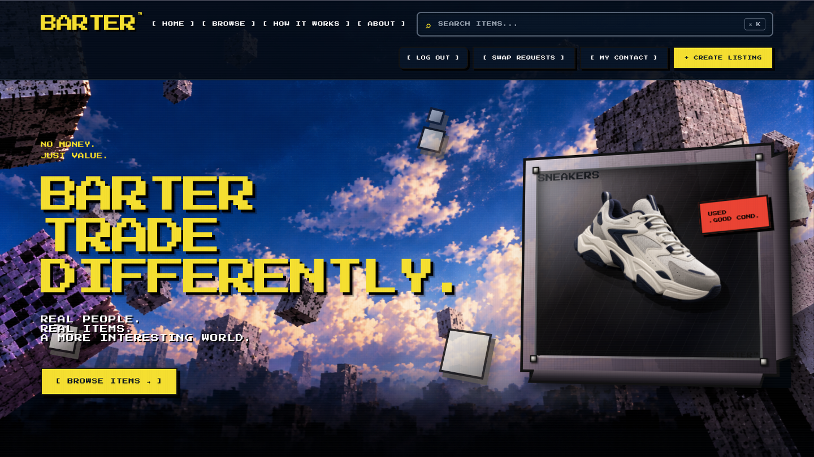
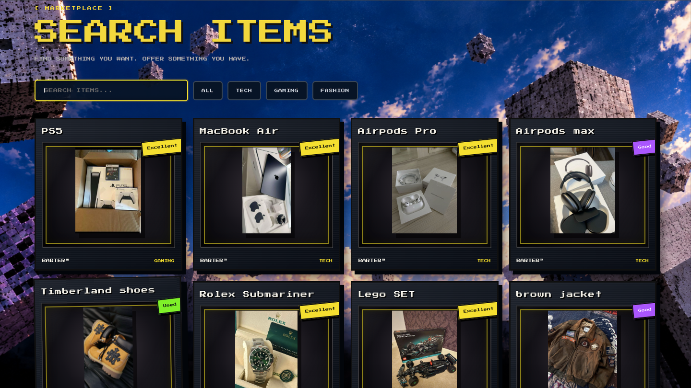
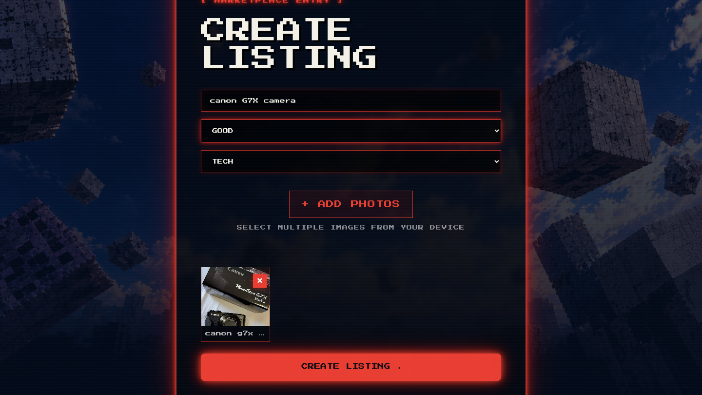
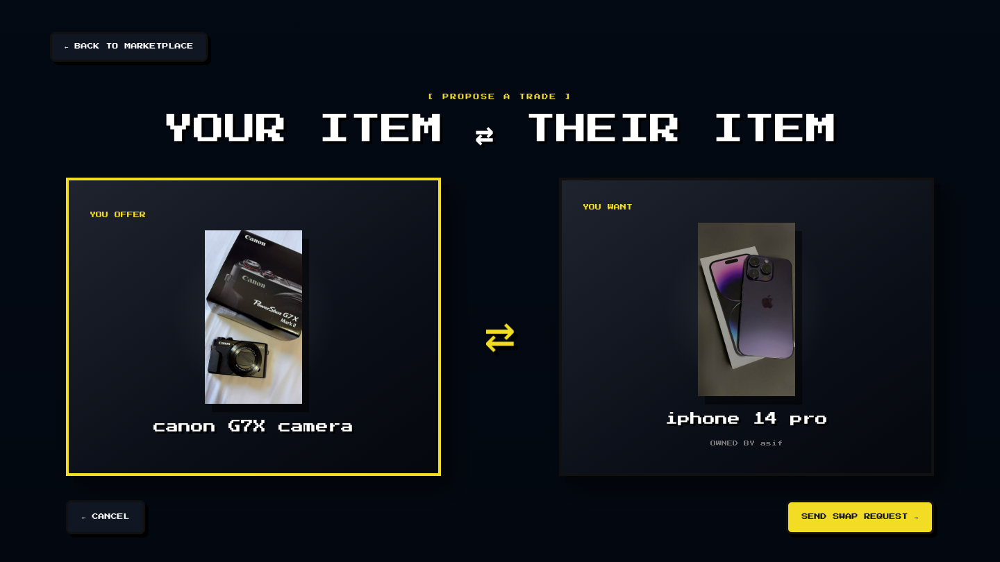
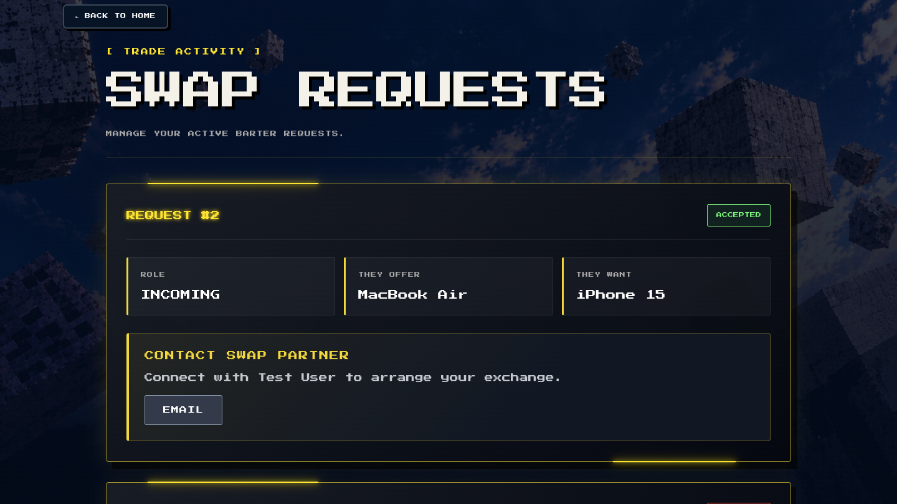
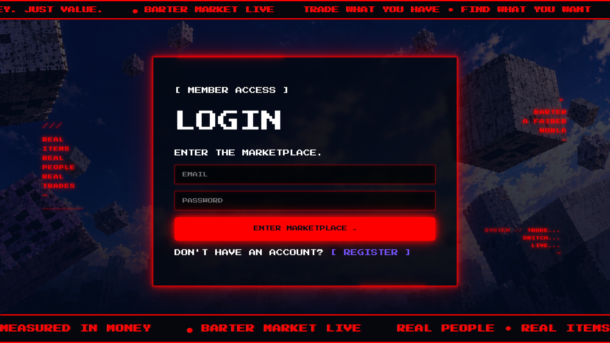

# 🔄 BARTER — Community Marketplace

> A full-stack MERN marketplace where people exchange items instead of purchasing them directly.

Barter is a hands-on full-stack web application built to explore how a real marketplace can connect users, listings, images, authentication, and item exchanges through a complete client-server architecture.

Users can create listings for items they own, describe what they want in exchange, browse other listings, send swap requests, accept or reject offers, and connect with an exchange partner after a trade is accepted.

  

---

## ✨ Features

### 👤 User Authentication
- User registration and login
- JWT-based authentication
- Password hashing with bcrypt
- Protected application functionality
- Authentication middleware on protected backend routes

### 📦 Listings
- Create item listings
- Add item name, category, condition, and desired exchange
- Upload multiple images
- Browse available listings
- Search listings
- View individual listing details
- Update owned listings
- Delete owned listings
- Listing ownership checks prevent users from modifying another user's listing

### 🖼️ Image Uploads
- Multiple images supported per listing
- Multer handles multipart image uploads
- Maximum of 5 images per listing
- Maximum file-size limit of 5 MB per image
- Server-side image validation
- Uploaded files are served through Express
- Image paths are stored with listing data in MongoDB

### 🔄 Swap Requests
- Select one of your own listings as an offer
- Send a swap request to another user
- View incoming requests
- View outgoing requests
- Accept or reject requests
- Accepted swaps mark the associated listing as swapped
- Swapped listings are excluded from the available swap-item selector

### 📞 Contact System
- Users can save phone and WhatsApp details
- Contact information can be updated through Contact Settings
- Contact information becomes available to the intended swap partner after an accepted exchange
- Supports Email, Phone, and WhatsApp contact actions

### 🎨 User Interface
- Custom futuristic marketplace design
- Responsive styling
- Homepage
- Browse marketplace
- Listing details
- Create Listing
- Swap Requests
- Contact Settings
- About page
- How It Works page
- React Router navigation

---

## 🎯 Project Purpose

The main purpose of Barter was to build a complete full-stack application rather than isolated features.

The project was designed to provide practical experience with:

- React frontend development
- Frontend/backend communication
- REST-style APIs
- Express routing
- MongoDB and Mongoose
- Authentication and authorization
- JWT bearer tokens
- Password hashing
- File uploads
- Multipart form data
- Database persistence
- CRUD operations
- Git and GitHub
- Debugging real application problems
- Preparing a full-stack application for deployment

The project was built as a hands-on learning and portfolio application.

---

## 💡 The Problem

Traditional online marketplaces usually focus on buying and selling items using money.

Barter explores a different model:

> Instead of asking "How much does this cost?", ask "What would you trade for it?"

A user can list something they own, specify what they would like in exchange, and receive offers from other users.

---

## 🖥️ Application Screenshots

### 🏠 Homepage

The homepage introduces the Barter concept and provides navigation to the marketplace and major application features.

  

---

### 🔎 Marketplace

Users can search and browse available items by category.

  

---

### ➕ Create Listing

Users can create a listing and upload multiple images from their device.

  

---

### 🔄 Propose a Trade

A user selects one of their own items and proposes it in exchange for another user's item.

  

---

### 📋 Swap Requests

Users can manage incoming and outgoing barter requests and view the status of their exchanges.

  

---

### 🔐 Login

Authentication provides access to user-specific marketplace functionality.

  

---

## 🛠️ Tech Stack

### Frontend

- HTML5
- CSS3
- JavaScript (ES6+)
- React
- React Router
- Vite
- Fetch API
- React hooks such as `useState` and `useEffect`

### Backend

- Node.js
- Express.js
- Multer
- bcryptjs
- JSON Web Tokens (JWT)
- REST-style API routes

### Database

- MongoDB Atlas
- Mongoose

### Development & Version Control

- VS Code
- Git
- GitHub

---

## 🏗️ Application Architecture

Barter follows a client-server architecture.

The React frontend communicates with the Express/Node.js backend through HTTP/REST API requests.

The backend handles:

- Authentication
- Authorization
- Application logic
- Listing operations
- Swap request operations
- File uploads
- Contact information
- Database operations

MongoDB Atlas provides persistent database storage through Mongoose.

### High-Level Architecture

    React + Vite Frontend
              │
              │ HTTP / REST API
              ▼
       Node.js + Express
              │
       ┌──────┼───────────────┐
       │      │               │
       ▼      ▼               ▼
    JWT     Multer       Application Logic
    Auth    Uploads            │
                               ▼
                           Mongoose
                               │
                               ▼
                         MongoDB Atlas

This separation keeps the frontend presentation layer separate from the backend API and database layer, allowing the application to be developed, tested, and deployed as separate layers.

---

## 🔄 How Barter Works

The main application flow is:

    User
      ↓
    React + Vite Frontend
      ↓
    HTTP / REST API Request
      ↓
    Node.js + Express Backend
      ↓
    Authentication / Business Logic
      ↓
    Mongoose
      ↓
    MongoDB Atlas
      ↓
    Backend Response
      ↓
    React updates the application

### Listing Creation Flow

    User fills listing form
          ↓
    React collects form data
          ↓
    FormData packages listing data + images
          ↓
    POST /listings
          ↓
    Express receives the multipart request
          ↓
    Multer processes uploaded files
          ↓
    Listing data + image paths are prepared
          ↓
    Mongoose writes the listing to MongoDB
          ↓
    Backend returns the response
          ↓
    React updates the application

---

## 🔐 Authentication

Barter uses token-based authentication to protect user-specific functionality and backend routes.

### Registration

When a user creates an account:

    User submits registration form
              ↓
    React sends registration data
              ↓
    POST /users/register
              ↓
    Express validates the request
              ↓
    Password is hashed using bcrypt
              ↓
    User document is stored in MongoDB
              ↓
    Registration response is returned

Passwords are not intended to be stored as plain-text values. The backend uses bcrypt to hash passwords before storing them.

### Login

    User submits email + password
              ↓
    React sends login request
              ↓
    POST /users/login
              ↓
    Express finds the user
              ↓
    bcrypt verifies the password
              ↓
    JWT is generated
              ↓
    Token is returned to the frontend
              ↓
    Frontend uses the token for protected requests

### Protected Requests

Protected requests send the token using:

    Authorization: Bearer <token>

The backend authentication middleware verifies the token before allowing protected operations to continue.

---

## 🔑 Authorization & Ownership

Authentication answers:

> "Who is this user?"

Authorization answers:

> "Is this user allowed to perform this action?"

Barter uses backend authorization checks for user-specific operations.

For example, when updating or deleting a listing:

    Request arrives
          ↓
    JWT is verified
          ↓
    Authenticated user is identified
          ↓
    Listing is found
          ↓
    Listing ownership is checked
          ↓
    Action is allowed or rejected

This prevents a user from simply changing a listing ID and modifying another user's listing.

Frontend restrictions are not treated as the primary security boundary. The backend is responsible for enforcing authorization.

---

## 📦 Listing & CRUD System

Listings form the core marketplace functionality.

The backend provides CRUD operations:

- Create
- Read
- Update
- Delete

### Listing Creation

    React form
       ↓
    FormData
       ↓
    POST /listings
       ↓
    Express
       ↓
    Authentication middleware
       ↓
    Multer
       ↓
    Mongoose
       ↓
    MongoDB

### Listing Retrieval

    React requests listings
          ↓
    GET /listings
          ↓
    Express
          ↓
    Mongoose queries MongoDB
          ↓
    Listing documents returned
          ↓
    React renders listing cards

Individual listings can also be retrieved through:

    GET /listings/:id

---

## 🖼️ Image Upload System

Barter uses Multer for handling listing image uploads.

The frontend sends listing data and images using `FormData`.

The backend receives the multipart request and Multer processes the uploaded files.

### Upload Flow

    User selects images
          ↓
    React stores selected files
          ↓
    FormData is created
          ↓
    POST /listings
          ↓
    Multer receives files
          ↓
    Files are written to uploads/
          ↓
    Image paths are generated
          ↓
    Listing document stores image paths
          ↓
    MongoDB stores the listing data
          ↓
    Express serves images through /uploads

Uploaded image files are served through:

    /uploads/<filename>

The backend exposes the local `uploads/` directory through the `/uploads` route.

### Upload Limits

- Maximum 5 images per listing
- Maximum 5 MB per image
- Image MIME-type validation

### Current Storage Limitation

The current local development implementation stores uploaded images in the local `uploads/` directory.

MongoDB stores the image paths, not the actual image binary.

The `uploads/` directory is intentionally excluded from GitHub.

This means a fresh clone of the repository will not contain the existing local uploaded images. A new developer can still run the application and upload their own images locally.

For production deployment, the application should move image storage to persistent cloud/object storage because local filesystem storage may not persist across deployments or instance replacement.

---

## 🔄 Swap Request Workflow

The swap system is the main business feature of Barter.

### Step 1 — User Finds an Item

A user browses the marketplace and opens a listing they are interested in.

### Step 2 — User Chooses Their Offer

The user selects one of their own listings as the item they are willing to exchange.

### Step 3 — Swap Request Is Created

The frontend sends:

    POST /swap-requests

The backend creates the request and stores it in MongoDB.

### Step 4 — Listing Owner Reviews Request

The owner can view incoming requests from the Swap Requests page.

### Step 5 — Accept or Reject

The listing owner can accept or reject a pending request.

    PUT /swap-requests/:id

### Step 6 — Accepted Swap

When a request is accepted:

    Swap request
          ↓
    Status becomes accepted
          ↓
    Associated listing becomes swapped
          ↓
    Listing is no longer available for normal swapping
          ↓
    Accepted swap partners can access the intended contact options

Swapped listings are also excluded from the offer selector so they cannot be used as active swap offers.

---

## 📞 Contact System

Barter includes a Contact Settings system for users who want to provide contact information for exchanges.

Users can save:

- Phone number
- WhatsApp number

### Contact Settings Flow

    Contact Settings page
          ↓
    GET /users/contact
          ↓
    Existing contact details loaded
          ↓
    User edits information
          ↓
    PATCH /users/contact
          ↓
    MongoDB updated
          ↓
    Updated details persist after refresh

Contact information associated with an accepted swap can be presented to the intended exchange partner.

The frontend supports:

- Email using `mailto:`
- Phone using `tel:`
- WhatsApp using `wa.me`

---

## 🔌 API Overview

Barter uses a REST-style API built with Node.js and Express.

Protected endpoints use JWT authentication through the:

    Authorization: Bearer <token>

### User & Authentication Routes

| Method | Endpoint | Authentication | Description |
|--------|----------|----------------|-------------|
| `POST` | `/users/register` | No | Register a new user |
| `POST` | `/users/login` | No | Authenticate a user and return a JWT |
| `GET` | `/user` | No | Retrieve users without password fields |
| `GET` | `/users/contact` | Yes | Retrieve the authenticated user's contact details |
| `PATCH` | `/users/contact` | Yes | Update the authenticated user's phone and WhatsApp details |

### Listing Routes

| Method | Endpoint | Authentication | Description |
|--------|----------|----------------|-------------|
| `GET` | `/listings` | No | Retrieve all listings |
| `GET` | `/listings/:id` | No | Retrieve a specific listing |
| `POST` | `/listings` | Yes | Create a listing and upload up to 5 images |
| `PUT` | `/listings/:id` | Yes | Update a listing owned by the authenticated user |
| `DELETE` | `/listings/:id` | Yes | Delete a listing owned by the authenticated user |

### Swap Request Routes

| Method | Endpoint | Authentication | Description |
|--------|----------|----------------|-------------|
| `POST` | `/swap-requests` | Yes | Create a new swap request |
| `GET` | `/swap-requests` | Yes | Retrieve the authenticated user's incoming and outgoing requests |
| `PUT` | `/swap-requests/:id` | Yes | Accept or reject a pending swap request |

When a swap request is accepted, the associated listing is updated to a `swapped` status.

### Static Image Files

Uploaded listing images are served through:

    /uploads/<filename>

---

## 📁 Project Structure

The repository is organized into frontend, backend, database-model, migration, and documentation components.

    Barter/
    │
    ├── frontend/
    │   ├── public/
    │   │   └── assets/
    │   ├── src/
    │   │   ├── components/
    │   │   │   └── ListingCard.jsx
    │   │   ├── About.jsx
    │   │   ├── App.jsx
    │   │   ├── App.css
    │   │   ├── Browse.jsx
    │   │   ├── ContactSettings.jsx
    │   │   ├── CreateListing.jsx
    │   │   ├── HowItWorks.jsx
    │   │   ├── ListingDetails.jsx
    │   │   ├── Login.jsx
    │   │   ├── Register.jsx
    │   │   ├── Router.jsx
    │   │   ├── SwapRequests.jsx
    │   │   ├── index.css
    │   │   └── main.jsx
    │   ├── index.html
    │   ├── package.json
    │   └── vite.config.js
    │
    ├── models/
    │   ├── listings.js
    │   ├── swapRequests.js
    │   └── users.js
    │
    ├── screenshots/
    │   ├── homepage.png
    │   ├── marketplace.png
    │   ├── create-listing.png
    │   ├── propose-trade.png
    │   ├── swap-requests.png
    │   └── login.png
    │
    ├── auth.js
    ├── index.js
    ├── migrate-listings.js
    ├── migrate-swap-requests.js
    ├── package.json
    ├── package-lock.json
    ├── README.md
    └── .gitignore

Local-only files such as `.env`, `node_modules`, `uploads/`, and migrated JSON data are intentionally excluded from the public repository where appropriate.

---

## 🗃️ Database

Barter uses MongoDB Atlas as its cloud database and Mongoose as the ODM.

The main data areas are:

### Users

Stores user information required for authentication and contact functionality.

Relevant fields include:

- `id`
- `name`
- `email`
- `password`
- `phone`
- `whatsapp`

Passwords are handled through the authentication system rather than returned in normal user responses.

### Listings

Stores marketplace item information, including:

- Listing ID
- Item information
- Category
- Condition
- Desired exchange
- Owner information
- Image paths
- Listing status

### Swap Requests

Stores barter requests between users, including:

- Request ID
- Requester
- Listing owner
- Offered listing
- Requested listing
- Request status

The associated listing is updated when a swap is accepted.

---

## 🔐 Environment Variables

The application uses environment variables for sensitive configuration.

The `.env` file is local and should never be committed to GitHub.

The project uses environment configuration for values such as:

    MONGO_URI
    JWT_SECRET

The actual values are intentionally not documented or exposed.

For deployment, these variables should be configured privately in the hosting platform's environment-variable settings.

---

## ⚙️ Installation

### Prerequisites

Install:

- Node.js
- npm
- MongoDB Atlas account or another MongoDB connection
- Git

### 1. Clone the Repository

Clone the Barter repository and move into the project directory.

    cd Barter

### 2. Install Backend Dependencies

From the project root:

    npm install

### 3. Configure Environment Variables

Create a `.env` file in the backend/project root.

Add the required environment variables:

    MONGO_URI=your_mongodb_connection_string
    JWT_SECRET=your_jwt_secret

Do not commit this file.

### 4. Install Frontend Dependencies

Move into the frontend:

    cd frontend

Then install dependencies:

    npm install

### 5. Start the Backend

Return to the project root and start the Express server using the project's configured start command.

The backend development server runs on port:

    3000

### 6. Start the Frontend

Inside the frontend directory, start the Vite development server using the project's configured development command.

The frontend development server runs on port:

    5173

### 7. Open the Application

Open the local Vite application in your browser.

---

## 🧪 Testing & Verification

Testing during development focused on the core user journeys and persistence of important data.

### Authentication

Verified during development:

- User registration
- User login
- JWT authentication
- Protected functionality
- Password hashing implementation

### Listings

Verified:

- Listing creation
- Multiple image uploads
- Image paths stored in MongoDB
- Uploaded images displayed correctly
- Images remained visible after refresh
- Listing browsing
- Listing details
- Listing ownership behavior

### Swap Requests

Verified:

- Creating swap requests
- Incoming/outgoing request display
- Accepting requests
- Rejecting requests
- Listing status changes after accepted swaps
- Swapped listings excluded from the available offer selector

### Contact System

Verified:

- Contact details can be updated
- Contact changes persist after refresh
- Accepted swap partners can receive intended contact options
- Email behavior
- Phone/WhatsApp actions

### Frontend

Verified during development:

- Homepage
- Navigation
- Browse/search flow
- Contact Settings
- Back to Home navigation
- Main application pages
- Responsive styling work

---

## 🧠 Technical Challenges & Solutions

One of the main goals of Barter was to encounter and solve real development problems rather than only follow a tutorial.

### 1. MongoDB Connection Configuration

A MongoDB connection initially failed because the MongoDB URI was not being loaded correctly from the environment.

The error indicated that the URI passed to Mongoose was undefined.

The issue reinforced the importance of:

- `.env` configuration
- Environment variables
- Correct variable names
- Loading configuration before connecting to MongoDB
- Keeping secrets outside source control

### 2. Moving Application Data to MongoDB

The project initially used local JSON-style data during development.

The application was migrated toward MongoDB Atlas using Mongoose.

Migration scripts were used to move existing listing and swap-request data into MongoDB.

This required understanding the difference between:

- Local JSON data
- MongoDB documents
- Mongoose models
- API responses
- Frontend state

### 3. Multiple Image Uploads

A normal JSON request is not designed to carry binary image files directly.

The solution was to use:

- `FormData` on the frontend
- `multipart/form-data`
- Multer on the Express backend
- Local file storage during development
- Image paths stored in MongoDB

The flow became:

    React
      ↓
    FormData
      ↓
    multipart/form-data
      ↓
    Express
      ↓
    Multer
      ↓
    uploads/
      ↓
    image paths
      ↓
    MongoDB

### 4. Image Persistence After Refresh

An important issue was ensuring that images were not only visible immediately after uploading but also remained available after refreshing the page.

The solution involved:

- Saving the uploaded file
- Saving its path in the listing document
- Serving the uploads directory through Express
- Constructing the frontend image URL from the stored path

This separated the actual image file from the database record while allowing React to retrieve the image.

### 5. Authentication Middleware

Protected routes needed a way to identify the authenticated user.

JWT authentication was introduced so the frontend could send a token with protected requests.

The backend middleware:

    Authorization: Bearer <token>

verifies the token and identifies the user before the protected route continues.

This became important for operations such as:

- Creating listings
- Updating listings
- Deleting listings
- Creating swap requests
- Managing swap requests
- Updating contact information

### 6. Listing Ownership

A frontend button alone is not enough to prevent another user from modifying a listing.

The backend therefore checks ownership before allowing update or delete operations.

The important principle is:

    Authentication
          +
    Ownership verification
          =
    Authorized listing operation

This is a backend responsibility and should not depend only on frontend visibility.

### 7. Swap State Management

The swap system needed to connect multiple pieces of application state.

For example:

    Pending Request
          ↓
    Accepted / Rejected
          ↓
    If Accepted
          ↓
    Listing becomes Swapped
          ↓
    Listing is removed from active swap selection

This required coordination between swap-request documents, listing documents, frontend rendering, and user actions.

### 8. Legacy Data Compatibility

During development, some older listing records used a different image representation from newer listings.

Older records could contain a single image field while newer listings used an `images` array.

The frontend was adjusted to support the existing data structure rather than requiring all older records to be recreated.

This was a practical lesson in maintaining compatibility while an application evolves.

### 9. Search Navigation

The homepage search functionality required the search value to be passed into the Browse page.

The frontend uses React state to capture the search input and navigation to transfer the query to the marketplace page.

The final flow is:

    User enters search
          ↓
    React stores search state
          ↓
    User presses Enter
          ↓
    Browse page opens with search query
          ↓
    Marketplace displays matching items

### 10. Contact Settings

Contact Settings needed to load saved information, allow edits, and persist changes.

The component:

- Fetches saved contact information
- Populates the inputs
- Uses the authenticated user's JWT
- Sends updates through PATCH
- Displays success/error feedback

The route was added through React Router.

### 11. Contact Information After Accepted Swaps

Contact information should not simply be exposed to every marketplace user.

The swap-request system was designed so that contact-partner information is attached in the intended accepted-swap context.

The frontend can then provide:

- WhatsApp
- Call
- Email

This connects the technical authorization model to an actual marketplace use case.

### 12. Local Image Storage and Deployment

Local image storage works during development but introduces an important deployment limitation.

The current implementation stores uploaded images in:

    uploads/

The repository intentionally does not contain this directory.

Therefore, the application source code can be cloned independently, but the existing local uploaded images are not part of the GitHub repository.

A production deployment should use persistent image storage such as managed object/image storage.

---

## 📊 API & Frontend Concepts Practiced

Barter provided practical experience with:

### Frontend

- React components
- Props
- State
- `useState`
- `useEffect`
- Controlled forms
- Form submission
- Fetch API
- JSON
- FormData
- Conditional rendering
- React Router
- Navigation
- Responsive CSS

### Backend

- Node.js
- Express
- Routes
- Middleware
- Authentication middleware
- HTTP methods
- Request bodies
- Route parameters
- Status codes
- REST-style API design
- Static file serving
- Multer
- Error handling

### Database

- MongoDB Atlas
- Mongoose
- Schemas
- Models
- Queries
- Document persistence
- Data migration

### Security

- JWT
- Bearer tokens
- bcrypt
- Authentication
- Authorization
- Ownership checks
- Environment variables
- Secret management

### Development

- Debugging
- Git
- GitHub
- `.gitignore`
- Repository cleanup
- Migration scripts
- Local development
- Deployment preparation

---

## 🚧 Known Limitations & Deployment Considerations

Barter is currently a local development application prepared for the next deployment stage.

The following areas require production configuration or further hardening:

### Image Storage

The current implementation uses local `uploads/` storage.

Production deployment should use persistent managed image storage.

### Frontend API URLs

Some frontend API/image references currently use the local backend address during development.

For deployment, these should be replaced with a configurable production API base URL using frontend environment variables.

### CORS

The deployed frontend and backend will have different origins.

Production CORS configuration must therefore allow the intended frontend origin.

### MongoDB Atlas

The deployed backend must be configured with the correct MongoDB Atlas connection string and appropriate network access settings.

### JWT Configuration

The production environment should use a secure private JWT secret and appropriate token configuration.

### Validation & Reliability

Further production hardening can include:

- Stronger schema validation
- More comprehensive input validation
- Better API error consistency
- JWT expiration configuration
- Rate limiting where appropriate
- Upload cleanup after failed operations
- Additional swap-state consistency checks
- Better handling of competing swap requests

These are deployment and hardening considerations rather than reasons to expand the core product unnecessarily.

---

## 🌱 Future Improvements

Potential future improvements include:

- Persistent cloud image storage
- Production deployment
- Environment-based API configuration
- Improved server-side validation
- Stronger swap consistency rules
- Better error and loading states
- More comprehensive automated testing
- Improved mobile experience
- Listing pagination
- Notifications
- User profiles
- Messaging between swap partners
- Trade history
- More advanced marketplace filtering

The focus after the current MVP is to improve reliability and deployment rather than continuously adding unnecessary features.

---

## 🚀 Deployment Direction

The intended production architecture is:

    React + Vite
          ↓
    Frontend Hosting
          ↓
    Production API
          ↓
    Node.js + Express
          ↓
    MongoDB Atlas

For images:

    React
      ↓
    Express / Upload Service
      ↓
    Persistent Cloud Image Storage
      ↓
    Image URL
      ↓
    MongoDB Listing Document

The local `uploads/` approach is suitable for development but should be replaced or adapted for persistent production storage.

---

## 📚 What This Project Demonstrates

Barter demonstrates progression from individual coding exercises to building a complete full-stack application.

The project combines:

    Frontend
       +
    Backend
       +
    Database
       +
    Authentication
       +
    File Uploads
       +
    CRUD
       +
    Business Logic
       +
    Git/GitHub
       +
    Deployment Preparation

It also demonstrates practical experience debugging problems across multiple layers of an application rather than treating the frontend and backend as isolated pieces.

---

## 👨‍💻 Author

The concept and idea behind Barter were entirely my own. I built this project as a hands-on application for learning, deployment, and professional growth over a two-month development period.

The project was developed to strengthen practical full-stack development skills through real implementation, debugging, database integration, authentication, image handling, and marketplace business logic.

This project represents my practical progression from building individual features to developing and preparing a complete full-stack application for deployment with guidance.

---

## 📌 Project Status

### Current Stage

    BUILD
      ↓
    TEST
      ↓
    GIT CLEAN
      ↓
    README
      ↓
    GITHUB ✅
      ↓
    DEPLOY ← NEXT
      ↓
    PROOF
      ↓
    LEARNING
      ↓
    CV
      ↓
    INTERVIEW

The repository has been pushed to GitHub and the documentation/screenshots are now being finalized before deployment.

---

## 🔗 Repository

GitHub Repository:

    amaancodesbro / Barter

---

## ⭐ Final Note

Barter was built as a practical learning project with the goal of understanding how a complete full-stack application works from the user interface all the way to the database.

The project focuses on learning through implementation:

    Think → Build → Debug → Test → Document → Deploy → Explain

The goal is not only to have a working application, but to understand the engineering decisions behind it and be able to explain them confidently.